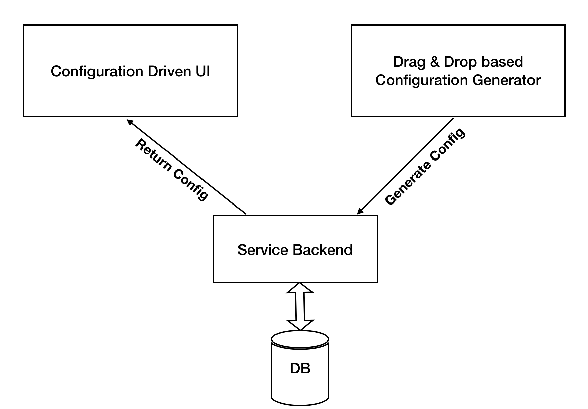
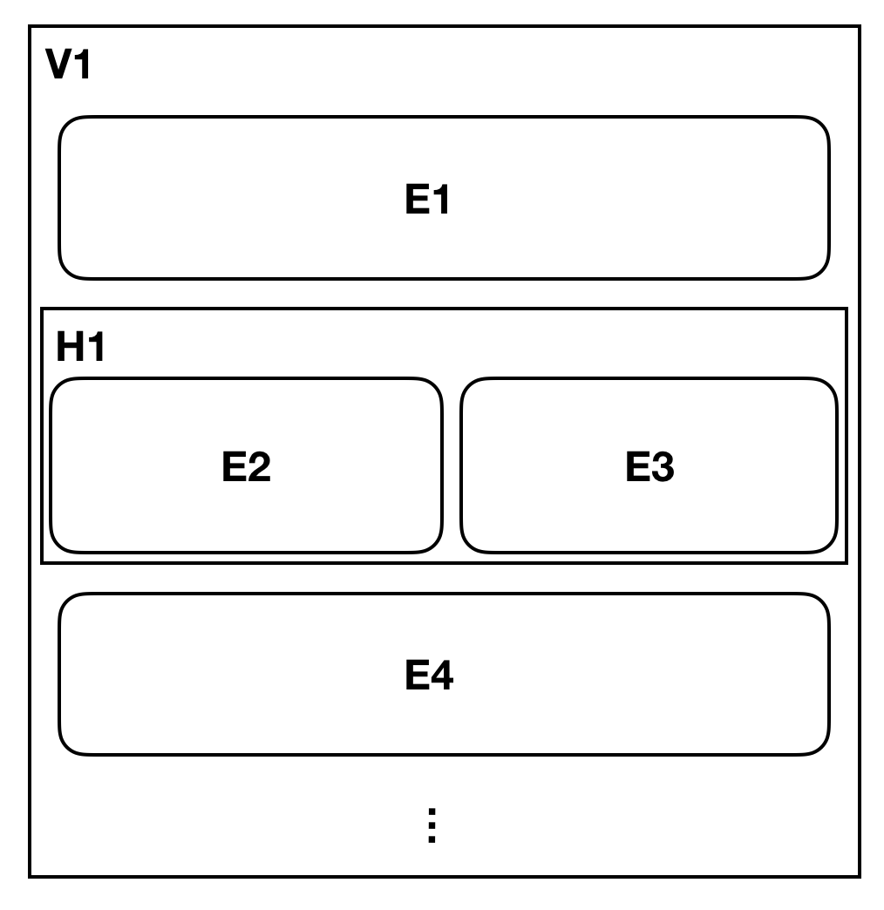

This is the first part of the 2 part blog, where I share my experience in putting together a configuration driven user interface.

The solution consisted of the actual UI that is generated by configuration and admin app where a user can drag and drop to build the configuration.
This blog specifically talks about how we handled the UI based on a JSON configuration.

## The Problem

Our customer wanted to build an enterprise dashboard that would help them to see display different dimensions of data in different pages.
Each page can follow a different layout consisting of Titles and it's corresponding Visualizations or summary.

One of their most important requirement was to have minimal or no dependency on developers for putting together these pages.
They had a few super users, who were good with writing queries and wanted to build a system that would help them to build a dashboard on their own.

# 10,000ft Solution

A part of our solution looked something like below.



The DnD Config Generator provides the user a UI where they can assemble the UI components together.
With the generated JSON configuration, a service call is made, which persists the same into a database.

When the executive dashboard needs to display the UI, it makes a restful call to the backend, which delivers the corresponding JSON from the database.

## The Config Driven UI

We wanted to solve the configuration driven UI first, to understand what kind of configurations were required and take that as a cue while putting together the config generator.
So we started to break down our problem and came up with 2 major components.

- Building the Layout
- Filling the gaps in the layout with actual values such as titles, visualizations and summary. We call this as an **Element**.

### Layout

The layout consisted of a bunch of elements that were stacked vertically, or horizontally.
So we needed to have containers that would let to stack the elements either vertically or horizontally.
There are also cases where we wanted to stack the Vertical / Horizontal containers inside each other or within themselves.



In the above example we have a vertical container that has elements E1 and E4 stacked vertically, along with a horizontal container H1.
H1 in-turn stacks in the elements E2 and E3 horizontally.

To achieve this we needed a recursive JSON configuration.

### Building the JSON configuration

We wanted to capture the following

- A way to identify Horizontal/ Vertical / Element
- Define widths of the Elements ( especially useful when horizontally stacked)
- Identify the elements with an `id` so that it can be replaced with content ( more of this later in the blog )
- Other configurations to appropriately paint the content inside an element.

So a sample JSON looked something like this.

```json
{
  "type": "Element",
  "config": {
    "id": "e1",
    "height": "200px",
    "color": "yellow",
    "width": "12"
  },
  "children": []
}
```

| Property | Description                                                               |
| -------- | ------------------------------------------------------------------------- |
| type     | One of the values in Element, Vertical or Horizontal                      |
| config   | Consists of a property `id` and other properties to help draw the element |
| children | An array of child nodes, which follow the same format                     |

Typically an `Element` will have an empty children and the others would have one or more items.

You can find a sample full blown JSON [here](./src/config/PageFormat.js)

### Working with the JSON

We used Material-UI as part of the project, and leveraged it's Grid to help with drawing our layout.

The Material UI defines Grids using `<Grid \>` tag. You can define a `<Grid container \>` that would contain many `<Grid item \>` which would have the content.
The `<Grid item \>` can also take a parameter called `xs` which can be a number between 1- 12 as defined by it's 12 grid layout.

Translating this to our solution, we will

- Have a Grid container for each of the `Vertical` items
- No special handling for `Horizontal` and just let the children be created
- `Elements` are rendered inside a Grid Item.

In the above case, both the `Elements` and `Vertical` are set with the width passed to it.

So we created a class called the [GridContainer](src/components/grid/GridContainer.js) that
takes an input config, which is nothing but a single element of the JSON, checks for it's type to be one in "Vertical", "Horizontal" or "Element" and

- For Vertical
  - It wraps inside a `<Grid item />`
  - Iterates through all it's children and wraps them with a `<Grid container />` each
  - Invokes the `GridContainer` again ( recursively ) with the child config value.
- For Horizontal
  - Iterates through the children and invokes the `GridContainer` for each of it's children.
- For Elements
  - Uses the config and draws the element.

The Key element of this class is how the config is used to build the layout in a recursive fashion.

## Handling the Elements

To Be Continued ...
